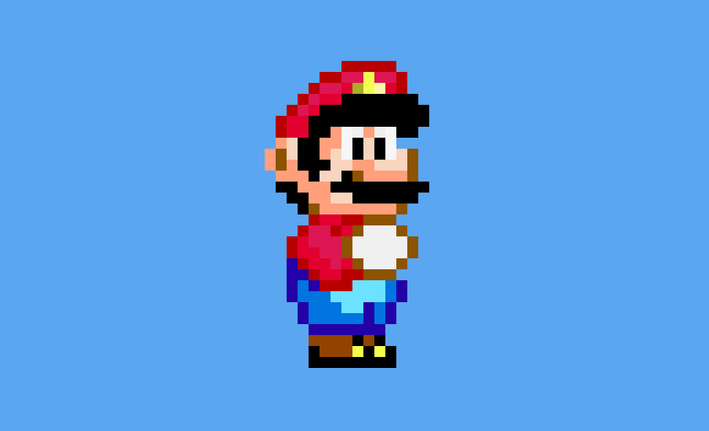

# 16-bit Super Mario (Pure CSS Pixel Art)

A **pure CSS pixel art recreation of Super Mario**, inspired by classic **16-bit era sprites**, built entirely with HTML and CSS, this is, no images, no canvas, no SVG.

This project explores pixel mapping, color layering, and grid-based composition using modern CSS techniques.



## Features

- **Pure CSS Pixel Art:** Every pixel is represented by a single HTML element styled with CSS.
- **Grid-Based Mapping:** The character is constructed using a fixed CSS Grid layout, simulating a pixel matrix.
- **Color Layering:** Multiple color variations (shadows, highlights, skin tones) recreate depth and volume.
- **Responsive Scaling:** Pixel size adapts via CSS variables and media queries.
- **No Images or JavaScript:** Entirely built with semantic HTML and CSS.

## Demo

Check out the live animation on [CodePen](https://codepen.io/guillhermm/pen/LEZxQdy).

## Running Locally

1. Clone this repository:

```bash
git clone https://github.com/Guillhermm/pure-css-animations.git
```

2. Navigate to the animation folder:

```bash
cd animations/16-bit-super-mario
```

3. Open the `index.html` file in any modern browser.

## Notes

- This project is a **static visual composition**, not an animation (yet).
- Each `.bit` represents a single pixel in the sprite.
- The pixel matrix is manually mapped using a CSS Grid with fixed columns.
- Colors are defined via utility classes for readability and maintainability.
- Designed as a study in **CSS pixel art**, grid systems, and visual reconstruction.
- The structure allows future extensions, such as animations or sprite states.

## Possible Extensions

- Idle or walking animations using CSS keyframes
- Sprite state variations (small, big, fire Mario)
- Dynamic pixel scaling controls
- Background and environment elements