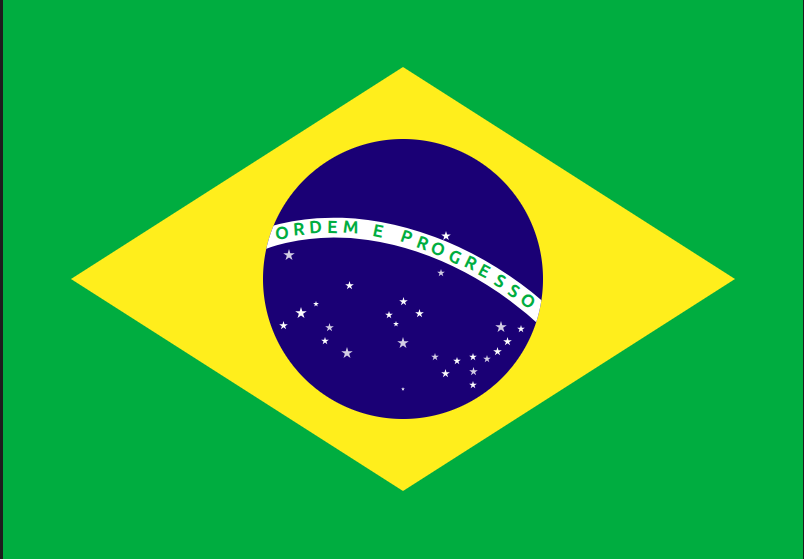

# Brazil Flag

An interactive, animated representation of the Brazilian flag using pure HTML and CSS.

This animation demonstrates how CSS can recreate complex flag elements, including the diamond, circle, stars, and the "Ordem e Progresso" banner, with subtle interactive hover effects.



## Features

- **Flag Design**: Diamond, circle, banner, and stars accurately positioned using CSS.
- **Interactive Stars**: Hover over each star to see the corresponding Brazilian state name.
- **Hover Effects**: The flag, diamond, and circle subtly scale and brighten on hover for a dynamic effect.
- **Pure CSS**: No JavaScript is used; everything is handled with HTML + CSS.
- **Responsive Scaling**: The flag scales up on larger screens for better visibility.

## Demo

Check out the live animation on [CodePen](https://codepen.io/guillhermm/pen/gbMreEX).

## Running Locally

1. Clone this repository:

```bash
git clone https://github.com/Guillhermm/pure-css-animations.git
```

2. Navigate to the animation folder:

```bash
cd animations/brazil-flag
```

3. Open the `index.html` file in any modern browser.

## Notes

- The animation works best on modern browsers supporting CSS transitions, transforms, and clip-path.
- Star positions are artistic, not astronomical, and scaled for the flag's proportions.
- Hovering over the stars reveals the state names as tooltips.