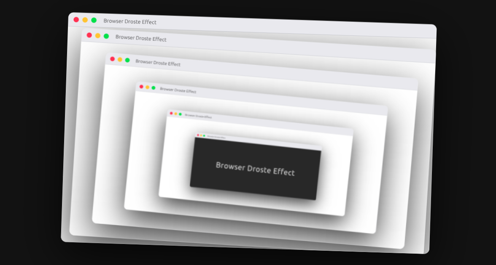

# Browser Droste Effect

A recursive browser window animation inspired by the Droste effect, created entirely with HTML and CSS.

This animation explores visual recursion and depth illusion using nested elements, CSS transforms, and subtle motion.



## Features

- **Recursive Layout:** Browser windows nested within themselves to create a Droste-style visual loop.
- **Depth Illusion:** Progressive scaling and animation delays simulate spatial depth.
- **Organic Motion:** A gentle “breathing” drift animation adds life and prevents static repetition.

## Demo

Check out the live animation on [CodePen](https://codepen.io/guillhermm/pen/GgqQWXM).

## Running Locally

1. Clone this repository:

```bash
git clone https://github.com/Guillhermm/pure-css-animations.git
```

2. Navigate to the animation folder:

```bash
cd animations/browser-droste-effect
```

3. Open the `index.html` file in any modern browser.

## Notes

- Uses modern CSS features such as transforms, variables, and keyframe animations.
- Designed to scale responsively across different screen sizes.
- Best experienced on modern browsers with good CSS animation performance.