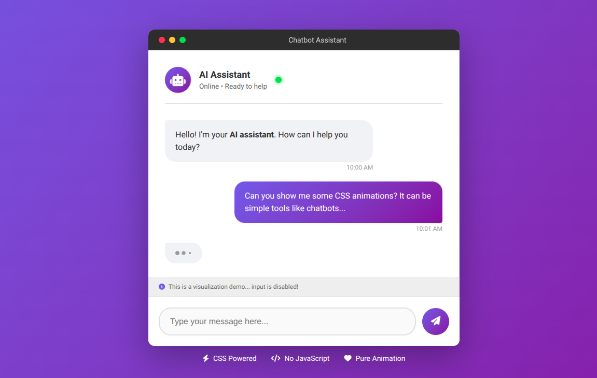

# Chatbot

A CSS-only animated chatbot interface designed to resemble a modern desktop chat application.

This project focuses on UI composition, micro-animations, and visual feedback patterns commonly found in chat interfaces.




## Features

- **Pure CSS Interface & Animation**: Built entirely with HTML and CSS. No JavaScript is used for interaction or animation.
- **Chat UI Simulation**: Recreates a realistic chatbot layout, including message bubbles, timestamps, typing indicators, and status elements.
- **Typing Indicator Animation**: Animated three-dot typing indicator using CSS `@keyframes` to simulate an active response state.
- **Desktop Window Styling**: MacOS-inspired window frame with controls, header, footer, and subtle elevation via shadows.
- **Micro-Interactions & Motion**: Message entry animations, pulsing avatar, glowing online status, and hover feedback enhance perceived responsiveness.
- **Responsive Layout**: Scales and adapts across screen sizes while preserving proportions and readability.

## Demo

Check out the live animation on [CodePen](https://codepen.io/guillhermm/pen/NPrvRKm).

## Running Locally

1. Clone this repository:

```bash
git clone https://github.com/Guillhermm/pure-css-animations.git
```

2. Navigate to the animation folder:

```bash
cd animations/chatbot
```

3. Open the `index.html` file in any modern browser.

## Notes

- This is a visual and structural demo (input is intentionally disabled).
- No real chat logic, networking, or AI behavior is implemented.
- Designed to showcase how far CSS alone can go in recreating complex UI patterns.
- Font Awesome is used exclusively for icons; all layout and motion is CSS-driven.