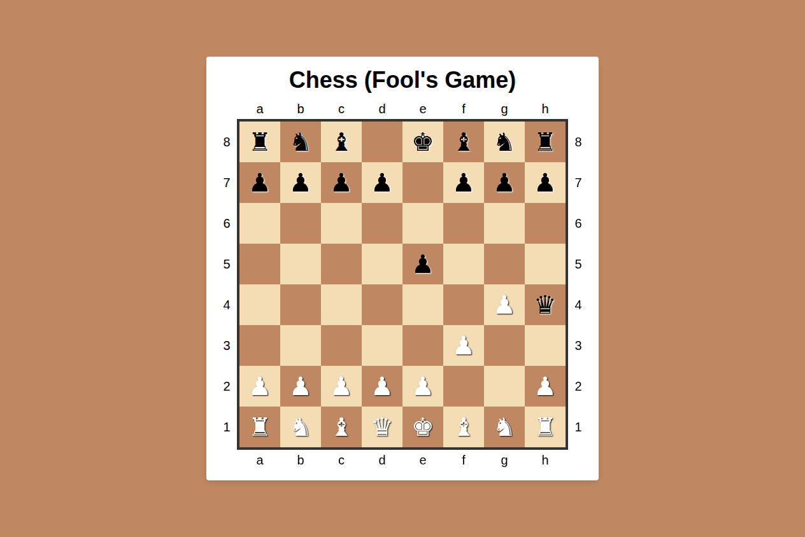

# Chess Animation (Fool’s Mate)

A CSS-driven chessboard animation recreating the Fool’s Mate, the fastest possible checkmate in chess.

This project focuses on layout precision, CSS keyframe animations, and visual sequencing, without JavaScript or game logic.



## Features

- **Fool’s Mate Recreation:** Animates the shortest checkmate sequence in chess history.
- **CSS-Only Animation:** All piece movements are handled using `@keyframes` and `animation-delay`.
- **Static Board Layout:** Chessboard and pieces are positioned using CSS Grid and absolute positioning.
- **Timed Move Sequence:** Each move plays in order using staggered animation delays.
- **Responsive Scaling:** Board, pieces, and coordinates scale smoothly across screen sizes.
- **Minimal & Lightweight:** No JavaScript, no dependencies, no build tools.

## Demo

Check out the live animation on [CodePen](https://codepen.io/guillhermm/pen/xbORwpQ).

## Running Locally

1. Clone this repository:

```bash
git clone https://github.com/Guillhermm/pure-css-animations.git
```

2. Navigate to the animation folder:

```bash
cd animations/chess-animation
```

3. Open the `index.html` file in any modern browser.

## Notes

- This project is a **purely visual experiment**, not an interactive chess game.
- There is no move validation, user input, or dynamic state handling.
- Piece movement relies entirely on CSS transforms and keyframe animations.
- Designed as a learning exercise in CSS animation timing and layout control.