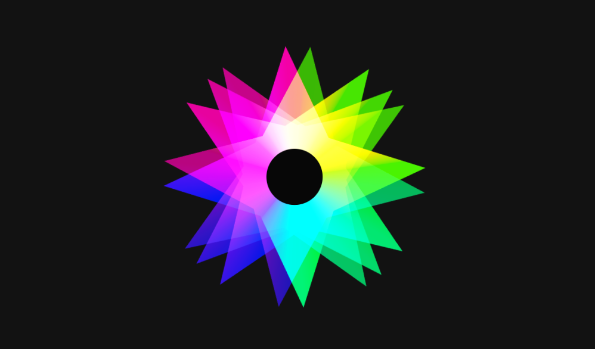

# Chromatic Shurikens

A CSS-only generative animation composed of layered, rotating shuriken shapes with dynamic chromatic gradients and rhythmic opacity transitions.

This project explores **conic gradients**, **blend modes**, and **multi-layered motion** to create a hypnotic, color-driven visual effect using only HTML and CSS.




## Features

- **Shortest Path Animation**: Visualizes node visits, edge checks, and updates distances dynamically.
- **CSS-Only Implementation**: No JavaScript; all animations handled via `@keyframes` and `animation-delay`.
- **Interactive Colors**: Nodes and edges change color when visited, current, or part of the shortest path.
- **Responsive Layout**: Graph scales across devices using CSS transforms.
- **Educational Visualization**: Highlights how Dijkstra’s algorithm progresses from start to target node.

- **Pure CSS Animation**: Built entirely with HTML and CSS, no JavaScript involved.
- **Conic Gradient Color Dynamics**: Each shuriken blade uses a conic gradient with continuous hue rotation for smooth chromatic transitions.
- **Layered Motion System**: Five overlapping shurikens rotate at different speeds, directions, scales, and opacity cycles to create depth and visual complexity.
- **Blend Modes & Visual Depth**: Uses `mix-blend-mode: screen` and subtle saturation/contrast tuning to enhance color interaction between layers.
- **Responsive Scaling**: The entire animation scales via a single CSS variable, adapting to different viewport sizes using media queries.
- **Hover Interaction**: A subtle scale-up effect adds a tactile feel when hovering over the composition.

## Demo

Check out the live animation on [CodePen](https://codepen.io/guillhermm/pen/XJKpyqz).

## Running Locally

1. Clone this repository:

```bash
git clone https://github.com/Guillhermm/pure-css-animations.git
```

2. Navigate to the animation folder:

```bash
cd animations/chromatic-shurikens
```

3. Open the `index.html` file in any modern browser.

## Notes

- The animation relies heavily on `conic-gradient`, `clip-path`, and CSS `@keyframes`.
- No SVGs or images are used (all shapes are generated via CSS).
- Designed as a visual experiment rather than an interactive component.
- Best experienced on modern browsers with full CSS gradient and blend mode support.