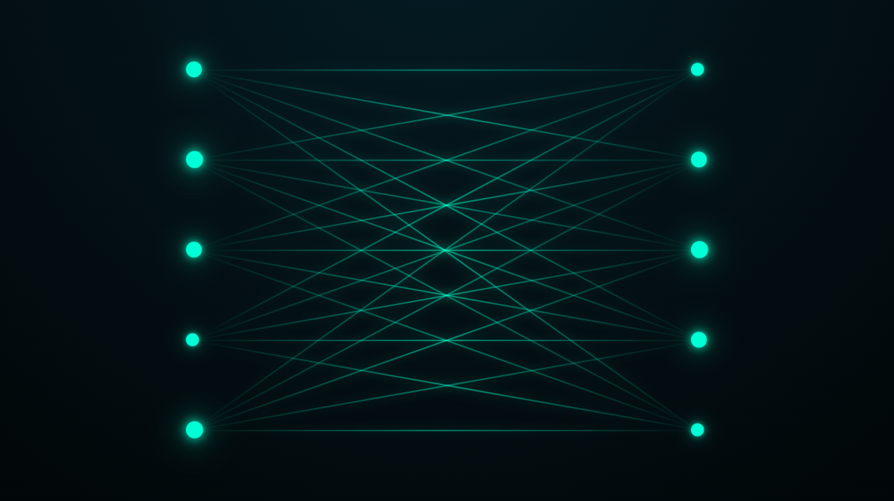

# Complete Bipartite Graph Animation

A pure CSS animation visualizing a **complete bipartite graph**, featuring glowing nodes and dynamically flowing edges.

This project explores spatial layout, geometric precision, and layered CSS animations to represent graph structures without JavaScript or SVG.



## Features

- **Complete Bipartite Graph Structure:** All nodes from the left partition connect to every node on the right partition.
- **CSS-Only Rendering:** Nodes and edges are built entirely with HTML divs and styled using CSS.
- **Animated Nodes:** Subtle pulsing animations simulate energy or activity across the graph.
- **Flowing Edges:** Gradient-based edge animations create a continuous motion effect.
- **Geometric Precision:** Edge lengths and rotations are manually calculated to maintain visual correctness.
- **Camera Drift Effect:** A slow scale and translation animation adds depth and motion to the scene.
- **No JavaScript:** No logic, no canvas, no SVG - just HTML and CSS.

## Demo

Check out the live animation on [CodePen](https://codepen.io/guillhermm/pen/YPWpJRv).

## Running Locally

1. Clone this repository:

```bash
git clone https://github.com/Guillhermm/pure-css-animations.git
```

2. Navigate to the animation folder:

```bash
cd animations/complete-bipartite-graph
```

3. Open the `index.html` file in any modern browser.

## Notes

- This project is a **purely visual representation** of a mathematical graph.
- There is no interactivity, data input, or graph logic.
- All edges are individually positioned using absolute positioning and CSS transforms.
- Diagonal edge lengths are calculated using CSS math functions to preserve proportions.
- Designed as an experiment in CSS geometry, animation layering, and visual abstraction.