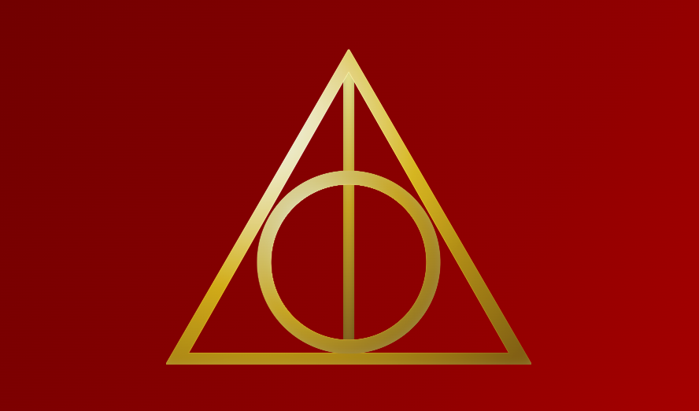

# Deathly Hallows

A CSS-only 3D composition recreating the Deathly Hallows symbol using layered geometry, depth stacking, and metallic lighting effects.

This project explores pure CSS 3D transforms, layer-based depth simulation, and specular shading to create a dimensional, rotating emblem without JavaScript or images.



## Features

- **Pure CSS 3D Rendering**: Built entirely with HTML and CSS using `transform-style: preserve-3d` and `perspective`.
- **Layered Depth Simulation**: Each relic (Elder Wand, Resurrection Stone, and Invisibility Cloak) is constructed from multiple stacked layers with controlled Z-depth and lighting variations.
- **Metallic Shading & Specular Highlights**: Gold materials are simulated using radial and linear gradients combined with brightness, contrast, and overlay effects.
- **Independent Relic Animation**: The Resurrection Stone and Invisibility Cloak rotate in alternating 3D motion, while the Elder Wand remains static as a structural anchor.
- **Backface Rendering**: The cloak includes front and back faces with distinct shading, creating a convincing flip effect during rotation.
- **Responsive Scaling**: The entire composition scales proportionally across screen sizes using CSS variables and media queries.

## Demo

Check out the live animation on [CodePen](https://codepen.io/guillhermm/pen/QwEvGzJ).

## Running Locally

1. Clone this repository:

```bash
git clone https://github.com/Guillhermm/pure-css-animations.git
```

2. Navigate to the animation folder:

```bash
cd animations/deathly-hallows
```

3. Open the `index.html` file in any modern browser.

## Notes

- No SVGs, images, or JavaScript are used.
- Depth is simulated by stacking identical elements with small Z-offsets and brightness adjustments.
- The project is designed as a visual and technical experiment rather than an interactive component.
- Best experienced on modern browsers with full support for CSS 3D transforms and gradients.