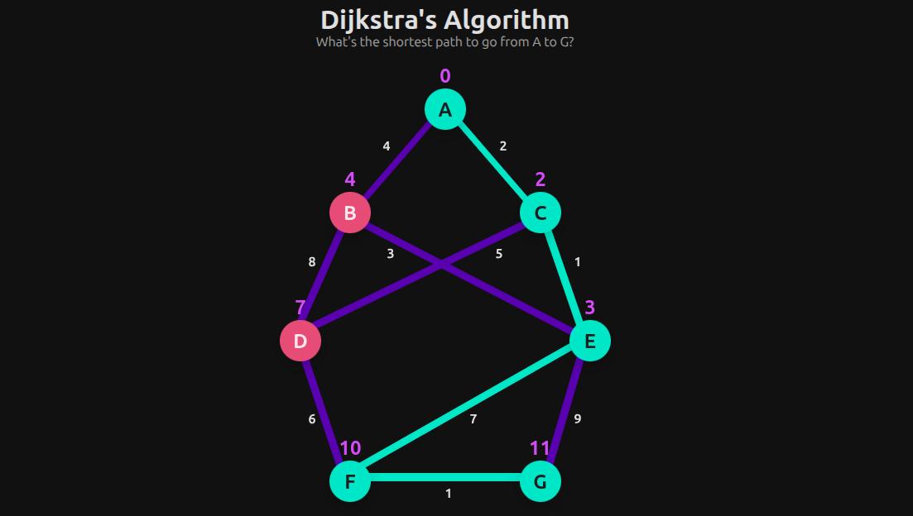

# Dijkstra's Algorithm

A CSS-only animation demonstrating **Dijkstra's shortest path algorithm** in a weighted graph, highlighting the step-by-step exploration and final shortest path.



## Features

- **Shortest Path Animation**: Visualizes node visits, edge checks, and updates distances dynamically.
- **CSS-Only Implementation**: No JavaScript; all animations handled via `@keyframes` and `animation-delay`.
- **Interactive Colors**: Nodes and edges change color when visited, current, or part of the shortest path.
- **Responsive Layout**: Graph scales across devices using CSS transforms.
- **Educational Visualization**: Highlights how Dijkstra’s algorithm progresses from start to target node.

## Demo

Check out the live animation on [CodePen](https://codepen.io/guillhermm/pen/VYjabdJ).

## Running Locally

1. Clone this repository:

```bash
git clone https://github.com/Guillhermm/pure-css-animations.git
```

2. Navigate to the animation folder:

```bash
cd animations/dijkstras-algorithm
```

3. Open the `index.html` file in any modern browser.

## Notes

- The shortest path highlighted is `A → C → E → F → G`.
- Node labels dynamically update to reflect distances during the animation.
- Fully compatible with modern browsers supporting CSS animations and transforms.