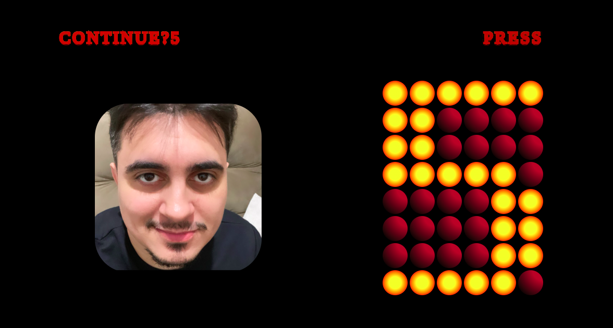

# Street Fighter Game Over

A CSS-only recreation of a classic Street Fighter style game over screen with retro arcade aesthetics.

This animation demonstrates how far CSS can be pushed to simulate pixel displays, countdown timers, and UI transitions without JavaScript.



## Features

- **Pixel Display Simulation:** Grid-based "bit" system recreates a segmented numeric countdown.
- **Animated Countdown:** The classic "Continue?" timer is fully driven by CSS keyframes.
- **Retro UI Effects:** Blinking "Press Start" prompt and bold arcade-style typography.

## Demo

Check out the live animation on [CodePen](https://codepen.io/guillhermm/pen/azZEZee).

## Running Locally

1. Clone this repository:

```bash
git clone https://github.com/Guillhermm/pure-css-animations.git
```

2. Navigate to the animation folder:

```bash
cd animations/street-fighter-game-over
```

3. Open the `index.html` file in any modern browser.

## Notes

- Carefully timed animations synchronize countdown, blinking prompts, and screen transitions.
- Uses CSS gradients to simulate glowing arcade pixels.
- Best viewed on modern browsers with full support for CSS animations and filters.